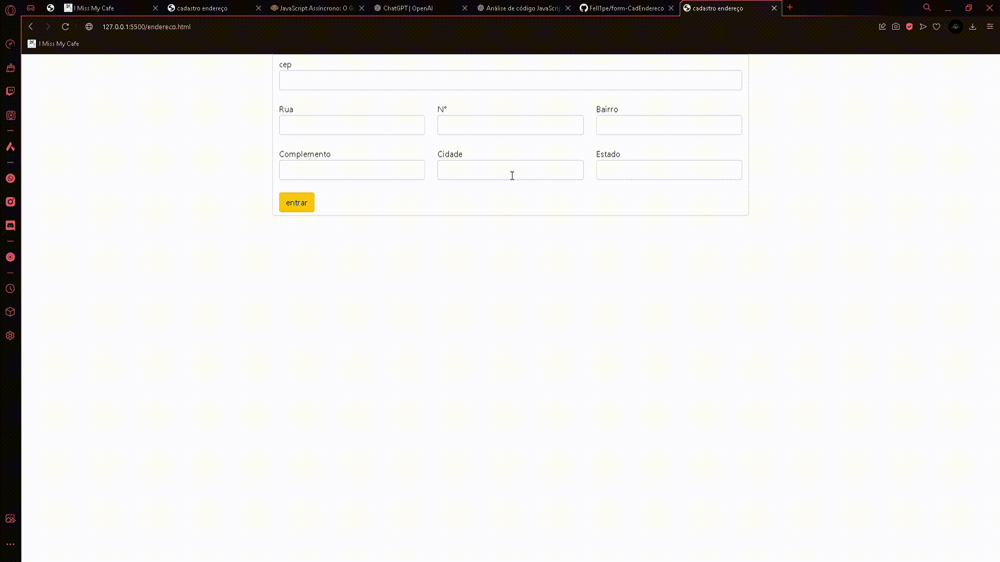
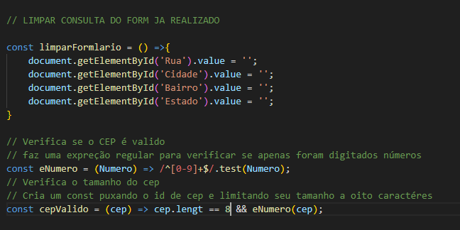

## Projeto CEP com API

Nesse projeto utilizamos de uma [API](https://viacep.com.br) para criar uma verificação de CEP onde por meio de javascript o Usuário deverá informar seu CEP e o código ira informalo caso seja incorreto ou caso contrario irá fazer o autopreenchimento com as informações obtidas no CEP.

 

**índice**

* [Tecnologias_utilizadas](#tecnologias-utilizadas)
* [Informações adicionais](#Informações-adicionais)
* [Adição da verificação de email](#adição-da-verificação-de-email)
* [Recursos](#Recursos)
* [Autores](#autores)

## Tecnologias utilizadas:

* [<code></code>](https://developer.mozilla.org/pt-BR/docs/Web/HTML)
* [<code></code>](https://github.com/)
* [<code></code>](https://git-scm.com/)
* [<code></code>](https://code.visualstudio.com/)
* [<code></code>](https://fontawesome.com/versions)

## Verificação de CEP:

* Nesse código começamos a criar uma verificação de CEP a partir da API(https://viacep.com.br/) do viacep nesse projeto criamos um códigó javascript que primeiramente 

    ### Cria uma const para limpar formulário já realizado.
    
    

* Nessa parte do código é utilizada uma constante para que as informações já obtidas no formulário sejam zeradas caso a constante seja utilizada. 

    ### cria uma função para verificar o tamanho do cep:

     

* Nessa parte do codigo é criado duas constantes para fazerr a verificação da qauntidade de caractéries do CEP inserido e também é verificado se o CEP contem apenas números caso não tenha apenas número ele irá ignorar os caracteres que não sejam números limitando o tamanho a 8 digitos. 

    ### cria verificação para constar se o CEP é valido:

* Nessa parte do código sera necessário uma melhor amostragem das partes secundárias por tras do código como o uso de funções assincronas.

    * Primeiramente é criado uma const pesquisarCep que usa uma função assincrona chamada async que possibilita o uso da funções await posteiormente.
    * ja dentro dessa const foi criada outra constante para puxar uma url da API utilizada no projeto nesse caso sendo o viaCep, onde dentro dessa url é puxada uma função cep.value para indicar onde o CEP informado pelo usúario deve ser colocado dentro da URL.
     

    

    * logo após é criado um if que puxa a const cepValido atribuindo a ela o nome cep.value utilizado acima na verificação da URL, ja dentro do mesmo é criado outra constante chamada de *dados* onde utiliza de um await que para que enquanto a fetch não retorne com uma promise para o códiigo, ele não continuara a ser execuctado. Logo após é inserido um fetch que vê se os números encontrados pela função eNumero agora colocados na URL são verdadeiros.
    * Em seguida é criado também outra const addres que novamente é utlizado um await para fazer a verificação da const para assim ela poder proceguir com o código, logo após é puxa a função criada ateriormente ´dados´ e e atribuida a própria uma caracteristica do javascript chamada ´json´ que transforma todas as informações obtidas anteriormente pela const.dados em texto.
     

    

    * Em seguida cria-se um if que utiliza a const addres já criada e adiciona uma propiedade chamada ´hasOwnProperty´ que verifica se dentro da API logo após a inserção dos dados não foi omitido uma mensagem de erro, caso a mesagem seja verdadeira if mostra um alert(´CEP não é valido´).
        * Caso contrario ele rodara um else que usara a função preencherFormulário puxando os valores de addres para dentro dos campos já pré setados anteriormente.
    * também caso o if que puxa a variavel cepValido não seja verdadeira rodará um else mostrando um alert(´CEP incorreto´).
     

    

    * No final do código é executada uma ação para fazer o preenchimento automático do formulário para que as informações sejam inseridas nos capos logo após o usuário deixar de selecionar o campo de CEP.

     

    

## Recursos:

* Documentação HTML5: [https://developer.mozilla.org/pt-BR/docs/Web/HTML](https://developer.mozilla.org/pt-BR/docs/Web/HTML)
* Documentação JavaScript: [https://developer.mozilla.org/pt-BR/docs/Web/JavaScript](https://developer.mozilla.org/pt-BR/docs/Web/JavaScript)

**Linkedin**

[publicação do projeto no linkedin](https://www.linkedin.com/posts/fellipe-zanin-1b1a7728b_github-fell1peform-cadendereco-activity-7247390421100744704-gYo9?utm_source=share&utm_medium=member_desktop)

## Autores
| [ Fellipe Gabriel Zanin](https://github.com/Fell1pe) |